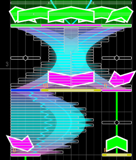

# 关于

这里是 UMIGURI 的专用谱面制作器 Margrete 的中文使用教程。

## 前言

这个教程将会帮助你熟悉 Margrete 的基本操作。

以下是给初次写谱玩家的推荐学习顺序：

1. [术语](docs/terminologies) 和 [操作界面](docs/basic/basic-screen-desc)。

2. [音符的种类 / 放置规范](docs/basic/basic-chart-regulation)。

3. 了解如何[编辑谱面](docs/basic/basic-edit-chart)。

4. 新建一张谱面，首先要 [设置谱面属性以及音源路径](docs/basic/basic-chart-property)； *或是打开 "UMIGURI\data\music\EXAMPLE\Example\Untitled.mgxc" 作为示例学习*

5. 准备工作大功告成，此时你便可以开始谱面创作了。
   * 进阶篇将会帮助你制作出一些更加炫酷的配置。参考群文件或是官方谱面同样也会为写谱提供很大帮助。

> Tip: 写谱的时候多多使用快捷键，能很大程度提高写谱的效率。

## 注意

* 本篇教程在[原文](https://margrete.inonote.jp/#/)的基础上额外增加了一些内容。
* 欢迎[加入群聊](http://qm.qq.com/cgi-bin/qm/qr?_wv=1027&k=vsMprVebJ4PS-PDhHOyga7c0TDdLKqDc&authKey=eCMiKDj2bPf446M2TsTz3X9ffjcJudpSsa%2B1oqnL%2BynjH3I1Zj3j54rLV%2B40dv%2B1&noverify=0&group_code=863841531")，讨论**创作或游玩UMIGURI谱面**。群聊意旨建设一个和谐的交流环境，请多多指教。
