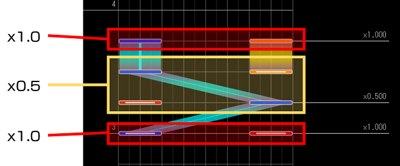
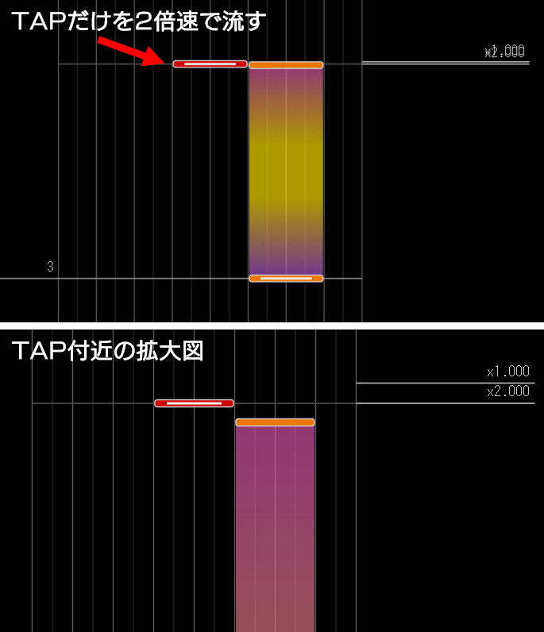

# ノーツ追い越し実装

個別にノーツの流れる速さを変えることで追い越しノーツを実装することができます。  

譜面全体の流れる速さを変えたい場合のページ → [ソフラン実装](advanced-softlanding)

## 方法

このエディタでは速度を変えたい対象のノーツを直接ではなく時間で範囲指定します。つまり、範囲内にあるノーツ全てに同じ速度が適用されます。

1. 編集ツールバーの  をクリックして選択モードに切り替えます。

2. 速度を変更したいノーツがある時間位置をクリックしてカーソル (赤線) を移動させます。

3. **挿入** > **ノーツ速度変更イベント** をクリックします。

4. 表示された画面で適用したい速度を入力し、**挿入** をクリックします。

### 備考

* 次のノーツ速度変更イベントが来るまでのノーツ全てにここで設定した速度が適用されます。

* 基本速度に戻したい場合は速度を `1.0` にして挿入します。

* 負数を指定して逆走させることができます。

* 絶対値が大きくなるほど流れる速度は速くなります。

## ノーツ速度適用の概観

## 同じタイミングのノーツそれぞれに異なる速度を擬似的に適用する

厳密に同じタイミングで配置されたノーツにそれぞれ異なる速度を適用することはできないので、ごく短い時間だけ前後にずらすことで個別に適用できるようにします。  

※ずらした結果 1 フレームの境界を跨いでしまい判定が変化することがあるため、判定に大きな影響がないノーツを調整することをおすすめします。  

