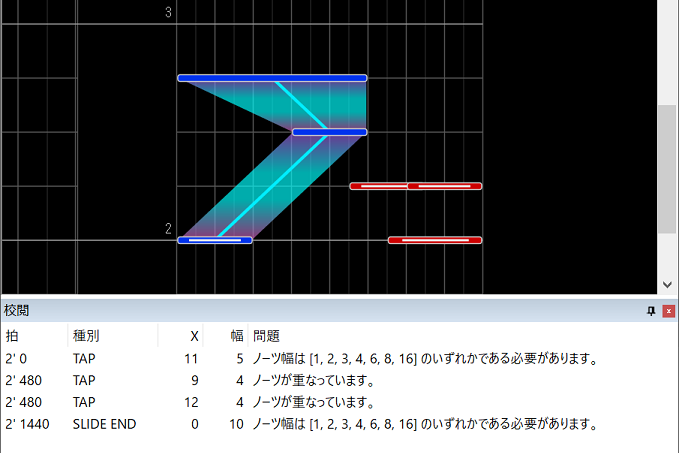

# 校閲機能 - レギュレーション違反を検出

レギュレーション違反がないか精査します。  

## 使い方

1. メニューの **ツール** > **校閲** をクリックします。

2. 評価設定を必要に応じて編集し、**実行** をクリックします。

3. **校閲ウィンドウ** 表示され、そこに結果が載ります。

* 校閲ウィンドウ内のリスト項目をダブルクリックすることで、問題のあるノーツにカーソルを飛ばすことができます。

* 「問題は見つかりませんでした」と表示された場合は、おめでとうございます、一応の体裁は整っているということです。

* 物理面 (腕の本数が足りるかどうか、まともにノーツ処理ができるかどうか) についてはこの機能では調べられないので、机の前で手を動かしたり実際に遊んだりして確かめる必要があります。

