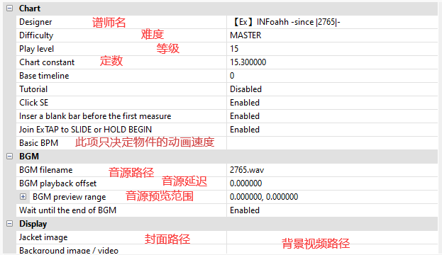

# 基础篇 - 编辑谱面属性 / 设置音源

## 编辑谱面属性

操作方法如下：

1. 点击菜单的 **File** >  **Chart Property**。

2. 填写所需要的内容，比如说曲师，曲名，难度。

3. 点击 **OK**， 直接关闭窗口不会保存已经填好的内容。

> 注意: 请务必不要留空 Song ID ，通常Margrete会帮你填写此项。

部分项目说明:  

> 注意：修改 **Basic BPM** 并不会改变谱面BPM，因此请注意要在开头[插入BPM更变事件](docs/basic/basic-edit-chart?id=插入BPM变更事件)

## 设置音源

1. 确保音源文件和谱面文件都在一个文件夹内

2. 将音源名（带扩展名）填写到**BGM filename**里。

> Tips: 推荐使用wav格式作为音源

1. 在设置好音源和BPM后，你可以通过试听来检查音符的时间是否和音源一致。

    * 点击标准工具栏的  或者按键盘的<kbd>Space</kbd> 键，就可以从光标（红线）的位置开始播放。再次进行同样的操作，就可以停止播放。

    * 当音源对不上的时候，可以填入音源延迟来调整（单位：秒）。
