# 基础篇 - 音符的种类和说明

## TAP

* 最基本的音符。

* 可以放置的音符宽度为  1, 2, 3, 4, 6, 8, 16 

## ExTAP

* 必定获得最高判定 (JUSTICE CRITICAL) 的 TAP 音符。

* 可以放置的音符宽度为  1, 2, 3, 4, 6, 8, 16 

## FLICK

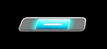

* 需要快速向左或右滑动的音符。

* **只在 MASTER 和 ULTIMA 难度出现。**

* 可以放置的音符宽度为  1, 2, 3, 4, 6, 8, 16 

## DAMAGE

* 碰到后会产生 MISS 判定的地雷音符。不碰则会获得最高判定 (JUSTICE CRITICAL)。

* **只在 WORLD’S END 难度出现。普通难度请不要使用。**

* 可以放置的音符宽度为  1, 2, 3, 4, 6, 8, 16 

## HOLD

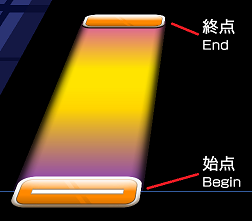

* 需要持续按到终点的音符。

* 可以放置的音符宽度为  1, 2, 3, 4, 6, 8, 16 

## SLIDE

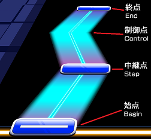

* 按照轨迹滑动到终点的音符。

* 可以放置的音符宽度为：

  * 起点、终点:  1, 2, 3, 4, 6, 8, 16 

  * 中继点、控制点:  1, 2, 3, 4, **5**, 6, 8, **10**, **12**, **14**, 16 

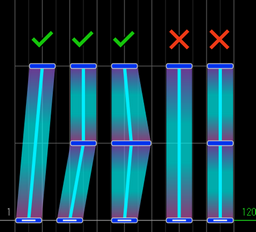

> *官方谱面中存在少许个例*

## AIR

* 挥动手臂往上 (AIR-UP) 或往下 (AIR-DOWN) 的音符。

* 可以放在 TAP、ExTAP、FLICK、DAMAGE 或 HOLD 和 SLIDE 的终点上。

* **只有在 WORLD'S END 难度才能使用颜色反转的 AIR。**

* 可以放置的音符宽度为： 1, 2, 3, 4, 6, 8, 16 

## AIR-HOLD

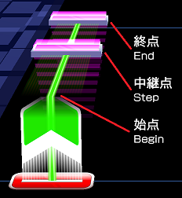

* 向上挥动手臂 (AIR-ACTION) 并保持到终点，在中继点和终点也需要挥动手臂 (AIR-ACTION) 的音符。

* 终点的音符可以删除。

    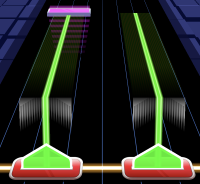

* 可以设置 AIR 颜色反转和 AIR-HOLD 高度。

    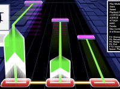

* 可以放置的音符宽度为： 1, 2, 3, 4, 6, 8, 16 

## AIR-SLIDE

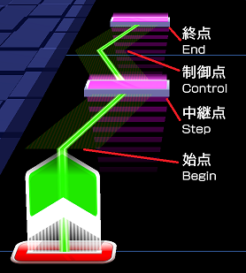

* 向上挥动手臂 (AIR-ACTION) 并保持到终点，在中继点和终点也需要挥动手臂 (AIR-ACTION) 的音符。

* 判定和 AIR-HOLD 一样。

* 终点的音符可以删除。

* 可以设置 AIR 颜色反转和 AIR-HOLD 高度。

    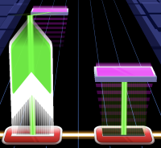

* 可以放置的音符宽度为：

  * 起点、中继点、终点:  1, 2, 3, 4, 6, 8, 16 

  * 控制点:  1, 2, 3, 4, **5**, 6, 8, **10**, **12**, **14**, 16 

## AIR-CRUSH

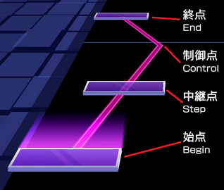

* 起点、中继点、终点需要挥动手臂 (AIR-CRUSH ACTION) 的音符。中间的线只是装饰，没有判定。

* 终点的音符可以删除。

* 
 装饰线的颜色可以改变。 

* 可以放置的音符宽度为：
  * 起点、终点:  1, 2, 3, 4, **5**, 6, 8, **10**, **12**, **14**, 16 

## AIR-TRACE

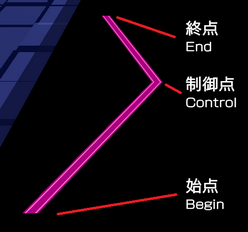

* 只是装饰线，并没有任何判定 (AIR-CRUSH ACTION) 的音符。

* 
 装饰线的颜色可以改变。 

* **本质上是没有终点、起点、以及控制点的AIR-CRUSH**

## ExSLIDE，ExHOLD

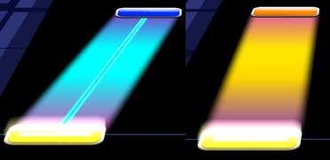

* 在[谱面属性设定](docs/basic/basic-export#step1-谱面属性设定)中启用 **Join ExTAP to SLIDE or HOLD BEGIN** 来使用。

* 在起点上叠加一个 ExTAP 来表示 ExSlide。

  * 如果上述设定未启用， TAP 和 ExTAP 就只会是单纯叠在一起而已。

* 如果想在起点上添加 AIR，就需要另外叠加一个 ExTAP ，并在这个ExTap上添加Air。

  * 也就是说，起点、ExTAP、带有 AIR 的 ExTAP 这**三个音符**会叠在一起。
  
    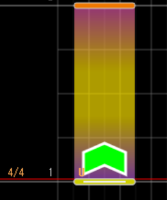

* **另外只要有一个 ExTAP 叠加，所有相同起点的判定都会变成 ExTAP 式的。**

  * 因此没有必要叠加多个 ExTap
  * 
    *（图中有两个相同的起点和一个ExTap相互叠加）*
    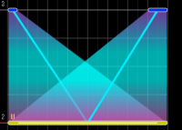

    
