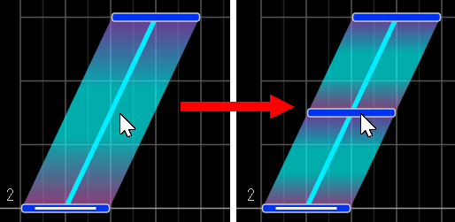
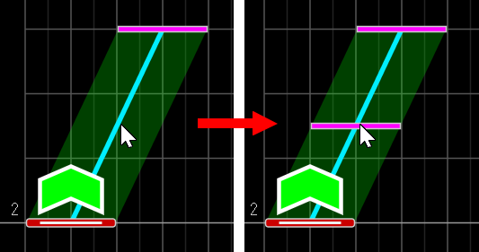
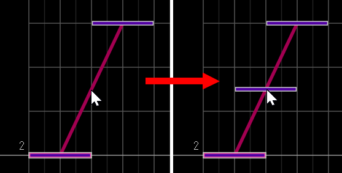
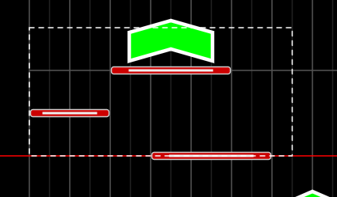
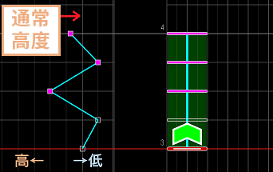
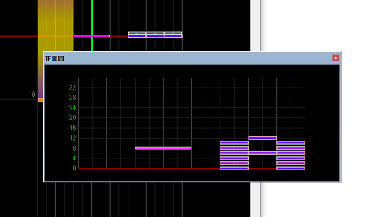

# 基础篇 - 谱面编辑

## 设置音符间隔 (时值)

在编辑工具栏设置音符的间隔。

## 设置不同的时间线 (Timing Group)

用来实现 [超车](advanced-softlanding) 变速的设定。音符和变速事件将与此处选择的时间线相关联。通常设置为 **TIL 0**。

## 插入音符

1. 选择编辑工具栏中的  切换到插入模式。

2. 在音符工具栏中选择要放置的音符。

   

3. 在谱面编辑区域中点击要插入的位置。

### 插入 SLIDE 控制点或中继点

点击这里阅读

1. 在音符工具栏中选择  或  。

2. 点击目标 SLIDE 的背景。

> Tips: 在插入控制点时，按住键盘上的 <kbd>Shift</kbd> 键就可以插入曲线控制点

### AIR-HOLD 中继点

点击这里阅读

1. 选择音符工具栏的  。

2. 点击目标 AIR-HOLD 的中心线。

### 插入 AIR-SLIDE 控制点或中继点

点击这里阅读

1. 在音符工具栏中，如果要插入控制点，选择  ，如果要插入中继点，选择  。

2. 点击目标 AIR-SLIDE 的背景。

### 插入 AIR-CRUSH 控制点或中继点

点击这里阅读

1. 在音符工具栏中，如果要插入控制点，点击  ，如果要插入中继点，点击  。

2. 点击目标 AIR-CRUSH 的中心线。

> Tips: AIR-CRUSH 中继点的横位置和宽度会自动改变

### 插入 ExSLIDE、ExHOLD

ExSLIDE、ExHOLD 的插入方法请参考 [音符的种类和说明#ExSLIDE、ExHOLD](docs/basic/basic-chart-regulation#ExSLIDE，ExHOLD)

## 移动音符的位置

在音符的中央附近拖动可以移动它们。

## 改变音符的宽度

在音符的左端或右端附近拖动可以改变它们的宽度。  

**除了控制点和 SLIDE 中继点以外，其宽度必须是 1, 2, 3, 4, 6, 8, 16 中的一个。**

> Tips: 一些音符不能改变宽度

## 单独编辑长音符的起点

移动或改变起点的宽度时，通常会连带长音符其他的部分。

1. 在菜单中选择 **Edit** > **Disable SLIDE-BEGIN Linking** 并打勾 （或是按下<kbd>F</kbd>切换）

2. 长音符的起点可以单独编辑了。

> Tips: HOLD 不受此影响

## 删除音符

1. 选择编辑工具栏的  切换到删除模式。

2. 点击要删除的音符。

> Tips: 拖动鼠标来选择范围，一次删除多个音符

## 批量操作音符或事件

1. 选择编辑工具栏的  切换到选择模式。

2. 在编辑区域内拖动鼠标，会出现一个用虚线表示的矩形，表示选择范围

3. 继续拖动并移动鼠标，选择范围会随之变化。

4. 松开鼠标按钮，此时确定选择范围。

> Tips: 长音符必须包含中继点、终点等全部部分才能被选中

### 批量移动音符

1. 将鼠标移动到用虚线表示的选择范围内。

2. 在这个范围下拖动鼠标。

3. 选择范围内的音符会被一起拖动。

### 批量删除音符

1. 按键盘上的 <kbd>Delete</kbd> 键，或者点击菜单中的 **编辑** > **删除选中音符** 。

2. 选择范围内的音符会被删除。

### 批量删除事件

1. 同时按键盘上的 <kbd>Shift</kbd> 和 <kbd>Delete</kbd> 键，或者点击菜单中的 **编辑** > **删除选中事件** 。

2. 选择范围内的事件会被删除。

## 改变 AIR-HOLD、AIR-SLIDE、AIR-CRUSH、AIR-TRACE 的高度

1. 在 AIR 高度调整区域（左边）内，拖动对应音符的手柄。

2. 音符的高度会被改变。

* 高度随着向右移动而降低，最右边表示地面。相反地，向左移动则高度升高。

* 所有的手柄都是单独移动的，如果想要批量移动，请使用 **正面视图** 。

### 使用正面视图

如果要改变重叠的音符的高度，使用 **正面视图** 可以更容易编辑。

1. 在菜单中选择 **View** > **Toolbars and Docking Windows** > **Front View** 并打勾。

2. 正面视图会显示出来。

* 正面视图会显示出光标 (红线) 所在位置的音符的剖面，可以拖动它们来移动高度。

* 拖动正面视图窗口的标题栏可以将其从主窗口分离或合并。

* **Disable SLIDE-BEGIN Linking** 也会影响在正面视图的拖动。

## 插入BPM变更事件

1. 选择编辑工具栏的  ，切换到选择模式。

2. 点击要插入的位置来移动光标 (红线)。

3. 点击菜单的 **Insert** > **BPM Change Event**。

4. 在弹出的窗口中输入 BPM 值，点击确定。

> Tips: 按下<kbd>B</kbd> 可以快速插入BPM变更事件

## 插入流速变更事件

1. 选择编辑工具栏的  ，切换到选择模式。

2. 点击要插入的位置来移动光标 (红线)。

3. 点击菜单的 **Insert** > **Scroll Speed Change Event**。

4. 在弹出的窗口中输入变速倍数，点击确定。

> Tips: 按下<kbd>N</kbd> 可以快速插入流速变更事件

## 插入拍子变更事件

1. 选择编辑工具栏的  ，切换到选择模式。

2. 点击要插入的位置来移动光标 (红线)。

3. 点击菜单的 **Insert** > **Time Signature  Event**。

4. 在弹出的窗口中输入拍号，点击确定。

> Tips: 按下<kbd>M</kbd> 可以快速插入拍子变更事件
