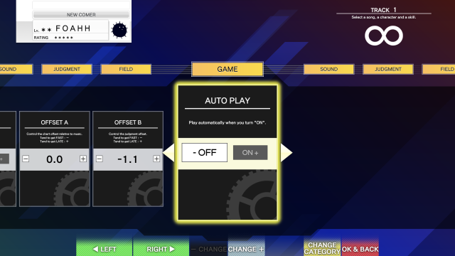
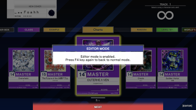
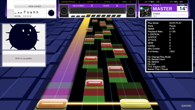

# UMIGURI 游玩

## Auto Play

* 选择 **Detailed Settings （选曲后的详细设置）" > **Game** > **Auto Play**

* 

## 写谱模式

* 在选曲界面按下<kbd>F4</kbd>进入写谱模式，再次按下<kbd>F4</kbd>则退出写谱模式。
 
  

* 写谱模式下可调整播放时间，更改流速/播放速度，以及检查无理配置。

  

* 使用方法

    |       キー       | 意味                       |
    | :--------------: | -------------------------- |
    |     ← 左矢印     | 后退一小节             |
    |     → 右矢印     | 前进一小节             |
    | Shift + ← 左矢印 | 后退 1 秒                   |
    | Shift + → 右矢印 | 前进 1 秒                   |
    |     ↑ 上矢印     | 增加谱面流速   |
    |     ↓ 下矢印     | 降低谱面流速   |
    | Shift + ↑ 上矢印 | 加快播放速度 |
    | Shift + ↓ 下矢印 | 减慢播放速度 |
    |      Space       | 播放 / 停止            |
    |        F3        | 切换自动 / 手动     |
    |        F5        | 重新加载谱面           |
    |        F6        | 从头开始           |
    |        F9        | 回到选曲画面             |
    |       F10        | 判定区域显示切换         |

> Tip: Umiguri中重新加载谱面和Margrete中快速导出谱面的快捷键都是</kbd>F5</kbd>，可以利用此功能快速预览谱面修改