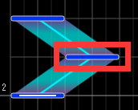
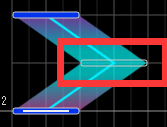
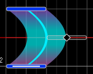

# 术语

## 事件(Event)

拍号、BPM、谱面速度变化

## 起点

[长音符](#长音符)的开始部分。

## 终点

[长音符](#长音符)的结束部分。

## 中继点(Step)

在[长音符](#长音符)之间放置的，可以产生连击的音符。

## 控制点(Control)

在[长音符](#长音符)之间放置的，可以改变其形状的音符。不会产生连击。

有以下两种类型：

* 控制点 (直线控制点)

  * 

* 曲线控制点 (贝塞尔曲线控制点)

  * 

## 长音符

指 SLIDE、HOLD、AIR-HOLD、AIR-SLIDE、AIR-CRUSH、AIR-TRACE 等。

